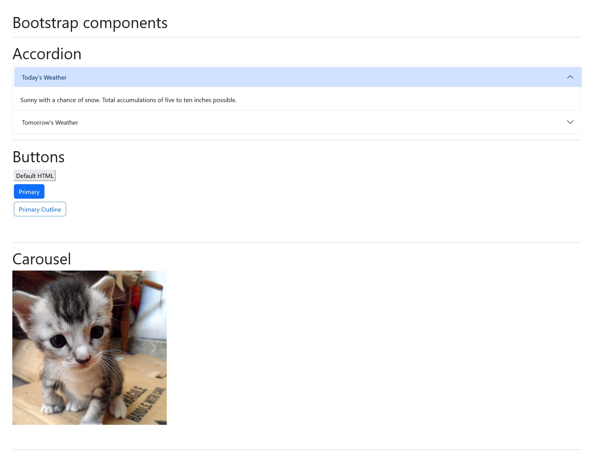

# Lecture 24 Practice
There are many CSS libraries and frameworks on the web that you can use simplify the styling of your site.  In this practice lesson we are going to look at [Bootstrap](https://getbootstrap.com) which is one of the most popular CSS frameworks.  There is extra CSS added to the `style.css` to format some of the spacing and sizing.

## Practice 1
1. Set up your HTML file using the [Quick Start](https://getbootstrap.com/docs/5.3/getting-started/introduction/#quick-start) guide.
2. Add the linking of the `style.css` file to the HTMl file
3. Update the page title from `Bootstrap demo` to `Lecture 23 Practice`
4. Update the `<h1>` text from `Hello, world!` to `Bootstrap components`
5. Create three instances of the below setup
   1. Inside a `div` create an `hr`, then an `h1`, followed by an empty line, and then two `br` elements.
   2. Copy and paste this set up three times

## Practice 2
1. In the first `h1` set the text to `Accordion`
2. Using the documentation in [Accordion - Bootstrap v5.3](https://getbootstrap.com/docs/5.3/components/accordion/) create an accordion with two sections
   1. In the first section have the title set to `Today's Forecast` and the body set to `Sunny with a chance of snow. Total accumulations of five to ten inches possible.`  This accordion element should be default to expanded.
   2. In the second section have the title set to `Tomorrow's Forecast` and the body set to `Chilly with blowing sand then light rain showers and heavy fog`.
 3. Verify that you can click on the titles to expand and collapse the two sections.

## Practice 3
1. Create three `button` elements with the type set to `button`.
2. The following steps should be based off of the [Buttons - Bootstrap v5.3](https://getbootstrap.com/docs/5.3/components/buttons/) documentation.
3. In the first button have the button text set to `Default HTML.
4. In the second button configure the button so that it is a primary button with text set to `Primary`.
5. In the third button configured the button so that it is a primary button with an outline and the text set to `Primary Outline`.

## Practice 4
1. Using the documentation in [Carousel - Bootstrap v5.3](https://getbootstrap.com/docs/5.3/components/carousel/) create a carousel using the four images in the `images` folder.
2. Verify the carousel is working by click the next and previous buttons to see each of the four pictures.

------

## Configuration

### GitDoc

GitDoc is a great extension to automatically commit and push changes into the repository. For developers who are just getting started with web development, configuring this extension to automatically save their changes can make the introduction into git version control a much less intimidating experience. Because the extension cannot be configured by default to automatically push the changes up to the repository, users will need to update the settings the first time they launch project in Codespaces.

1. On the right-hand side of the `Codespaces` editor, click on the `Extensions` icon.

 

2. Once the `Extensions` sidebar expands, click on the gear icon in the `GitDoc` extension card and then select `Extension Settings` from the menu.

3. Update the `Auto Commit Delay` to the number of milliseconds you would like the plugin wait before checking for file changes. The number is in milliseconds, 1 second = 1000 milliseconds. I've found the 5000 is a good number to use.

 

4. (Optional) Change the `Commit Validation Level` to `none`. This will allow all changes, even those that might include code which has errors in it, to be saved.

 

5. Check the box associated with `Enabled` under the `Commit Validation Level` section.

6. Refresh the page in your browser so that the settings can be applied to the editor.
